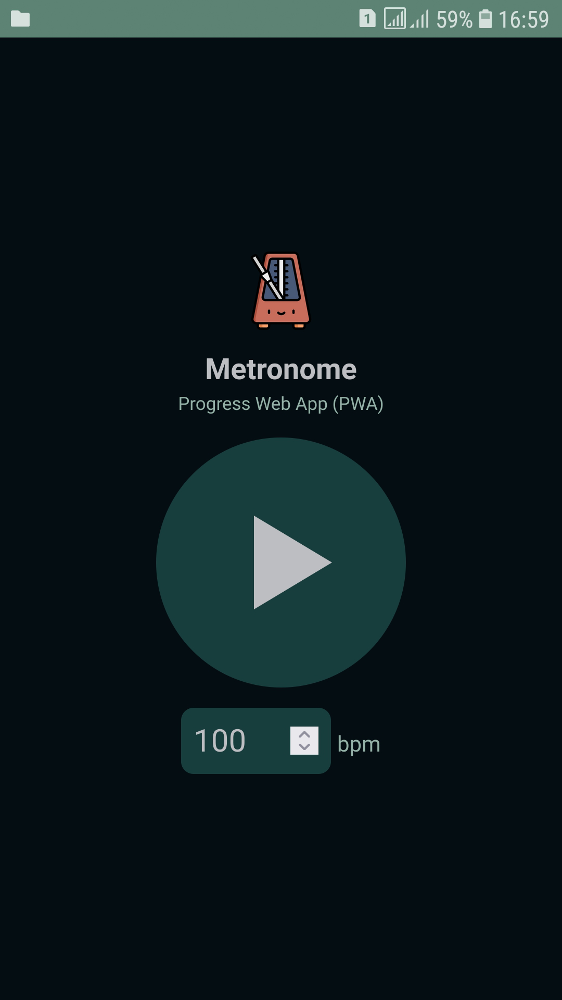
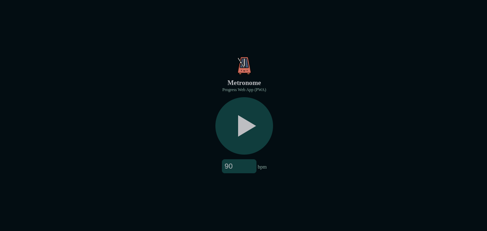

<h3 align="center">
Metronome Progressive Web App (PWA) [Works offline]
</h3>

  

[https://prijal-bista.github.io/metronome-pwa](https://prijal-bista.github.io/metronome-pwa/)

A simple metronome web app which also works offline.

Motivation:

> I Needed a metronome for my practice but did not have enough storage in my mobile to install an app for it. So, went ahead and built a lightweight pwa so that i can easily install it and use whenever i want, especially when offline :)

Features:

- progressive web app, so works offline. Uses network first approach, delivers from cache if network request fails. Also if network request succeeds, cache gets updated with latest changes.

- The logic for metronome is derived from https://github.com/grantjames/metronome so huge thanks to [grantjames](https://github.com/grantjames).

#### Screenshots

<table style="padding:10px">
  <tr>
    <td>
      
    </td>
    <td>
      
    </td>
  </tr>
</table>
